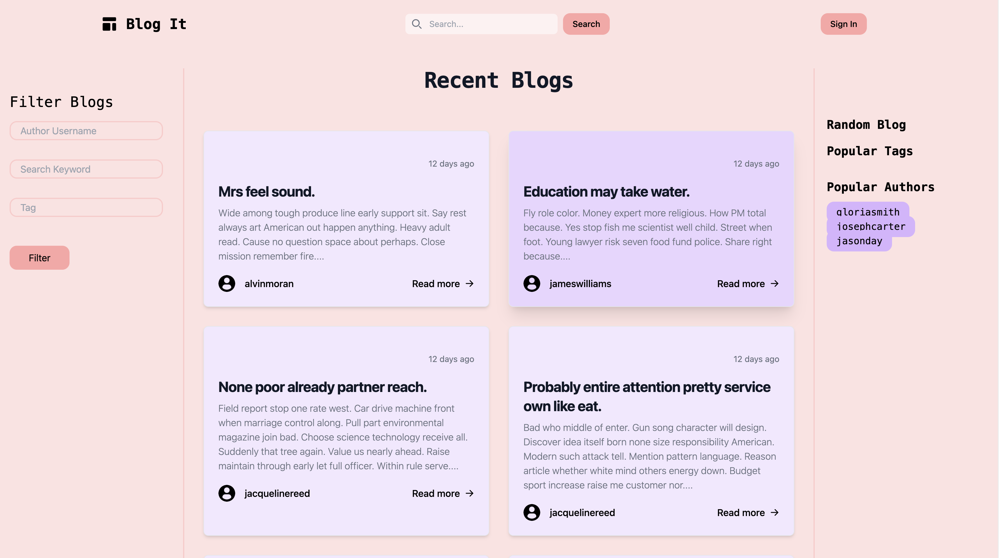
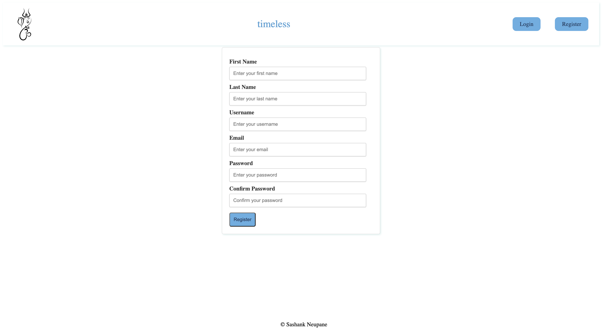
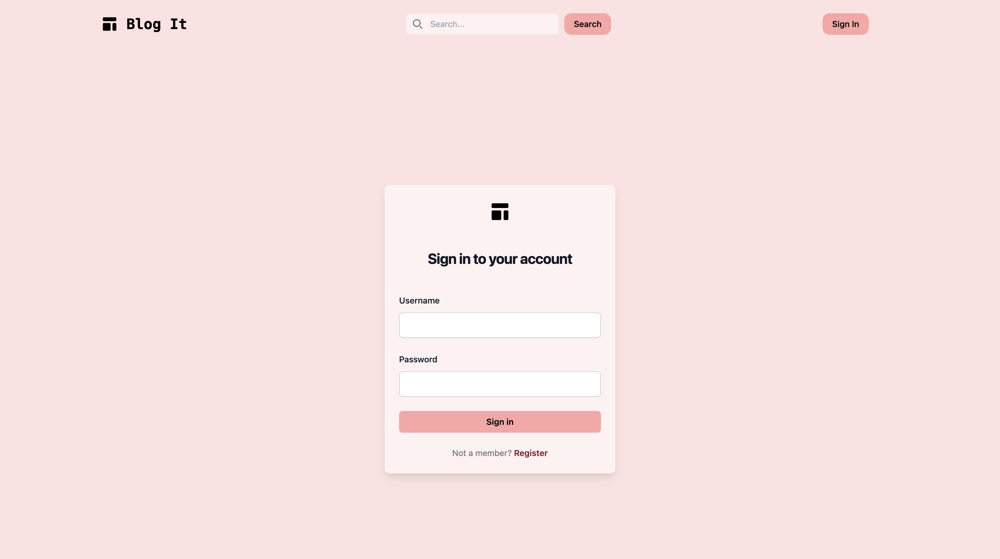
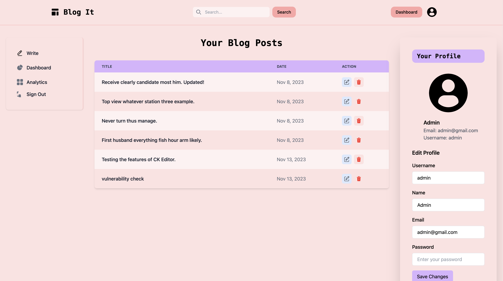
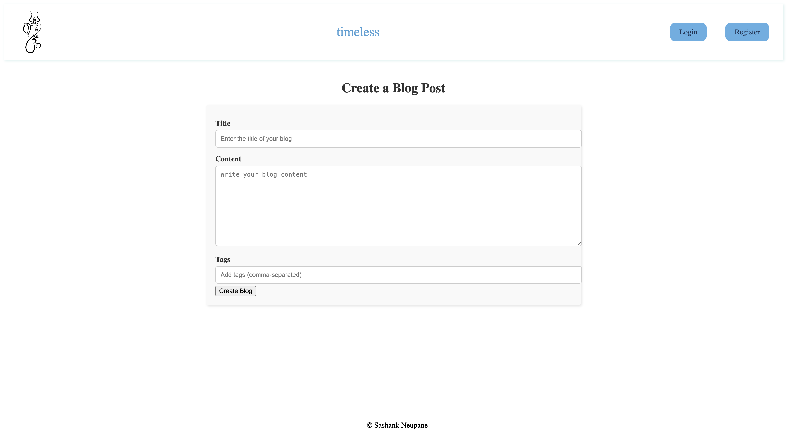
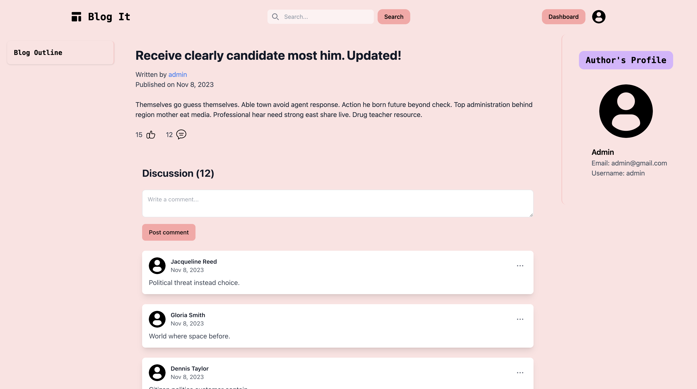
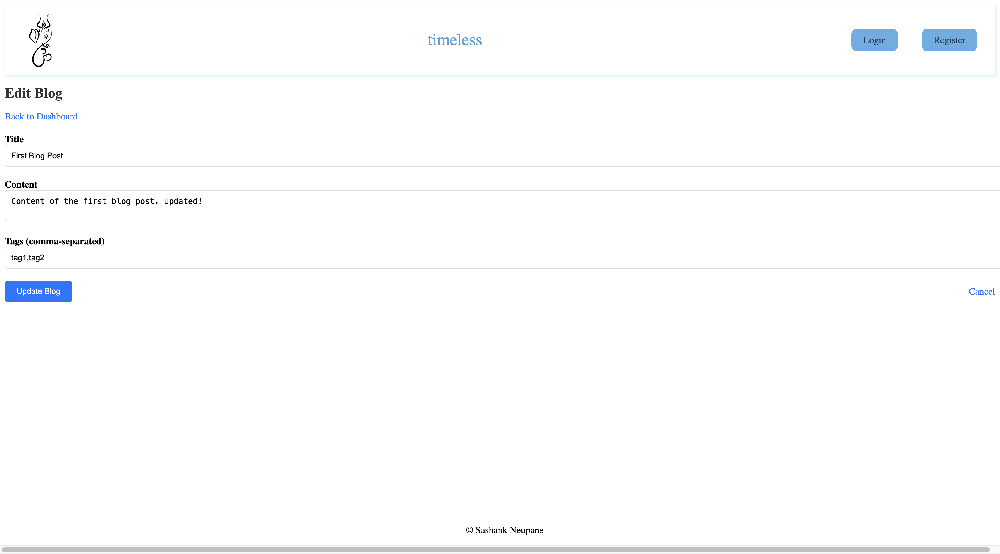
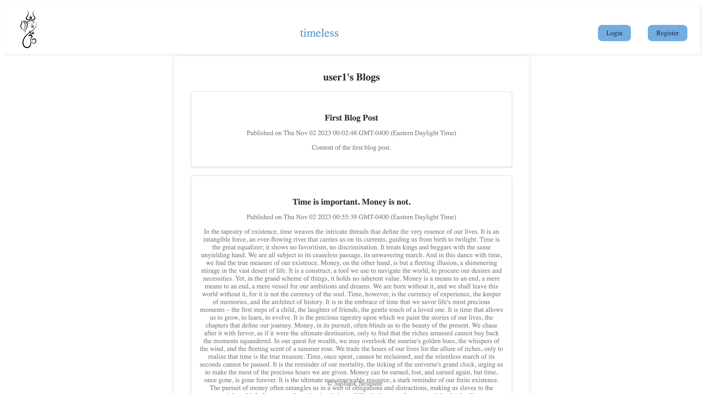
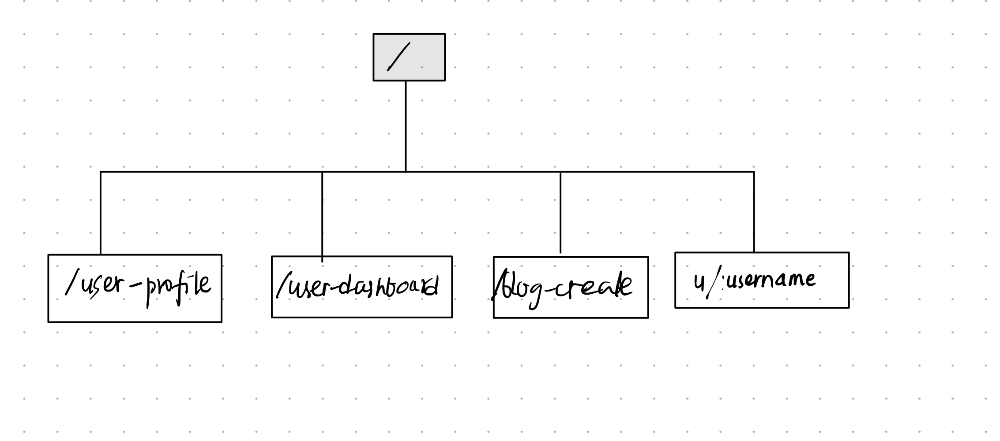

# Simple Blog Site

## Overview

This simple blog site will be a platform for people to write and share it to the world. I will create a site that will support all creation, update, and deletion of existing/new blogs from the site itself.

Only authenticated users can write blogs and blogs written by a user can be seen in their profile page. Users can also see all blogs written by other users in the home page.

## Data Model

The application will store Users and Blogs.

* users can have multiple blogs (via references)

An Example User:

```javascript
{
  username: "shannonshopper",
  email: // a valid email address,
  hash: // a password hash,
  name: "Shannon Shopper",
  blogs: // an array of references to Blog documents
}
```

An Example Blogpost with Embedded Items:

```javascript
{
  author: // a reference to a User object
  title: "Why is Javascript so hard?",
  content: "I've been trying to learn Javascript for the past 2 years and I still don't understand it."
  timestamp: // timestamp
}
```

## [Link to Commented First Draft Schema](db.mjs) 

## Wireframes

/ - home page


/register - registration page


/login - login page


/dashboard - user dashboard page


/blog-create - blog create page


/blog/:blogId - blog post page


/blog/:blogId/edit - blog edit page


/u/:username - user's public blog page



## Site map



## User Stories or Use Cases

1. **User Registration:**
   - As a new user, I want to be able to register with a unique username and email, so I can create an account and start using the blog site.

2. **User Login:**
   - As a registered user, I want to be able to log in using my username and password, so I can access my account and personalized features.

3. **Password Recovery:**
   - As a user, I want to be able to recover my password in case I forget it, so I can regain access to my account.

4. **User Profile:**
   - As a user, I want to have a profile page that displays my username, name, email, and a list of my blog posts, so I can manage my personal information and view my authored content.

5. **User Dashboard:**
   - As a logged-in user, I want to see a dashboard where I can create new blog posts and view my existing posts, so I can easily manage my blog content.

6. **Blog Creation:**
   - As a user, I want to be able to create new blog posts by providing a title and content, so I can share my thoughts and stories with others.

7. **Blog Listing:**
   - As a user, I want to see a list of all blog posts, so I can discover and read content authored by other users.

8. **Individual Blog Post View:**
   - As a user, I want to view an individual blog post's title and content when I click on it, so I can read the full post.

9. **Blog Editing:**
   - As the author of a blog post, I want to be able to edit the content of my existing posts, so I can make updates or corrections.

10. **Blog Deletion:**
    - As the author of a blog post, I want to be able to delete my own blog posts, so I can remove content as needed.

11. **User Logout:**
    - As a logged-in user, I want the ability to log out, so I can secure my account and data when I'm done using the site.


## Research Topics

(__TODO__: the research topics that you're planning on working on along with their point values... and the total points of research topics listed)

* (5 points) Integrate user authentication and allow for password recovery. 
    * I am going to be using passport for user authentication
    * I am also going to be using nodemailer to send emails to users
    * I will allow password recovery by sending a recovery code to the user's email
* (4 points) Perform client side form validation using a JavaScript library
    * I will perform multiple client side form validations using some library or my own functions
* (3 points) Configuration management
  * I will use dotenv to manage configuration variables like in class
* (2 points) Use a tailwind css
  * I will use tailwind css to style my site

## [Link to Initial Main Project File](app.mjs) 

## Annotations / References Used

(__TODO__: list any tutorials/references/etc. that you've based your code off of)

1. [passport.js authentication docs](http://passportjs.org/docs) - (add link to source code that was based on this)
2. [nodemailer docs](https://nodemailer.com/about/) - (add link to source code that was based on this)