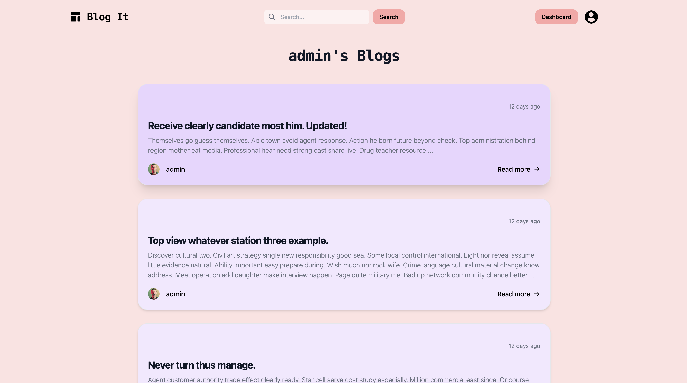
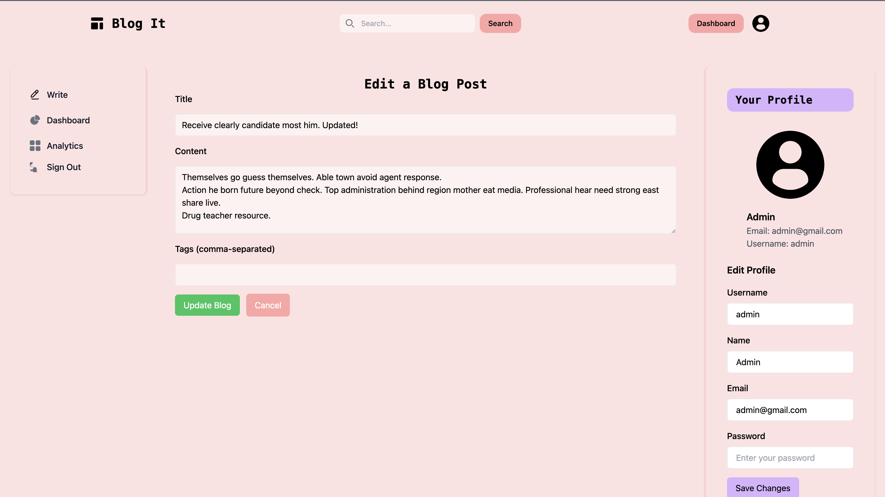

# Simple Blog Site

[ait-project.sashankneupane.com](http://ait-project.sashankneupane.com)

## Overview

The blogsite will be a platform for people to write and share blogs to the world. The site will support all creation, update, and deletion of existing/new blogs from the site itself. The site will also support user authentication.

Only authenticated users can write blogs and blogs written by a user can be seen in their profile page. Authenticated users can also view all blogs written by other users in the home page.

## Data Model

The application will store Users and Blogs.

- users can have multiple blogs (via references)

An Example User:

```javascript
{
  username: "shannonshopper",
  email: // a valid email address,
  hash: // a password hash,
  name: "Shannon Shopper",
  blogs: // an array of references to Blog documents
}
```

An Example Blogpost with Embedded Items:

```javascript
{
  author: // a reference to a User object
  title: "Why is Javascript so hard?",
  content: "I've been trying to learn Javascript for the past 2 years and I still don't understand it."
  timestamp: // timestamp
}
```

## [Link to Commented First Draft Schema](db/models/Blogpost.mjs)

## Site Map and Pages

| Page             | Description                                      | Path                 | Image                                                    |
| ---------------- | ------------------------------------------------ | -------------------- | -------------------------------------------------------- |
| Home             | Home page                                        | `/home`              |               |
| Login            | Login page                                       | `/login`             |             |
| Register         | Registration page                                | `/register`          |       |
| User Public Page | Public page displaying user's blog posts         | `/u/:username`       |    |
| Blog Page        | Page displaying a specific blog post             | `/blog/:blogId`      |          |
| Edit Blog Page   | Edit page for a specific blog post (author only) | `/blog/:blogId/edit` |     |
| Write Blog Page  | Page for writing a new blog post (logged-in)     | `/blog/write`        |  |
| User Dashboard   | Dashboard with blog management options           | `/u/dashboard`       |     |

## User Stories or Use Cases

| #   | User Story                | Description                                                                                                 |                             |
| --- | ------------------------- | ---------------------------------------------------------------------------------------------------------------------------------------- | --- |
| 1   | User Registration         | New users can register with a unique username and email to create an account and access the blog site.                                   |
| 2   | User Login                | Registered users can log in using their username and password to access their accounts and personalized features.                        |     |
| 4   | User Profile              | Users have a profile page displaying their username, name, email, and a list of authored blog posts for personal information management. |
| 5   | User Dashboard            | Logged-in users can access a dashboard to create new blog posts and edit/delete existing content easily.                                 |
| 6   | Blog Creation             | Users can create new blog posts by providing a title and content, sharing their thoughts and stories.                                    |
| 7   | Blog Listing              | Users can view a list of all blog posts, discovering and reading content authored by others.                                             |
| 8   | Individual Blog Post View | Users can read the full title and content of individual blog posts when they click on them.                                              |
| 9   | Blog Editing              | Authors of blog posts can edit the content of their existing posts, making updates or corrections.                                       |
| 10  | Blog Deletion             | Authors of blog posts can delete their own posts, removing content as needed.                                                            |
| 11  | User Logout               | Logged-in users can log out to secure their accounts and data when they're done using the site.                                          |

## Research Topics

| Checkbox | Points | Description                                                                |
| :------: | :----: | -------------------------------------------------------------------------- |
|    ✅    |   2    | [Integrate user authentication with Passportjs](https://github.com/nyu-csci-ua-0467-001-002-fall-2023/final-project-sashankneupane/blob/master/middlewares/auth.mjs#L9-L60)                              |
|    ✅    |   3    | Implement client-side form validation. [[1](https://github.com/nyu-csci-ua-0467-001-002-fall-2023/final-project-sashankneupane/blob/master/public/js/auth/registration.mjs#L37-L95) [2](https://github.com/nyu-csci-ua-0467-001-002-fall-2023/final-project-sashankneupane/blob/master/public/js/blogs/write-blog.mjs#L83-L92) [3](https://github.com/nyu-csci-ua-0467-001-002-fall-2023/final-project-sashankneupane/blob/master/public/js/blogs/edit-blog.mjs#L93-L103)] and multiple other places         |
|    ✅    |   1    | [Use dotenv to manage sensitive config variables.](https://github.com/nyu-csci-ua-0467-001-002-fall-2023/final-project-sashankneupane/blob/master/config.mjs#L1-L2)                        |
|    ✅    |   2    | [Deploy the application on a Digital Ocean Droplet with a Namecheap domain.](http://ait-project.sashankneupane.com) |
|    ✅    |   2    | [Style the site using Tailwind CSS.](./public/styles.css), [Config files](./tailwind.config.js)                      |

## [Link to Initial Main Project File](app.mjs)

## Annotations / References Used

1. [passport.js authentication docs](http://passportjs.org/docs) - ([usage](middlewares/auth.mjs))
2. [Tailwind CSS](https://tailwindcss.com)- ([usage](/tailwind.config.js#L1-L11))
3. [Flowbit](https://flowbite.com/docs/components/) - For some tailwind components
4. [dotenv](https://www.npmjs.com/package/dotenv) - ([usage](config.mjs#L1-L2))
5. [Digital Ocean](https://www.digitalocean.com/) - For hosting the application
6. [Namecheap](https://www.namecheap.com/) - For the domain name
